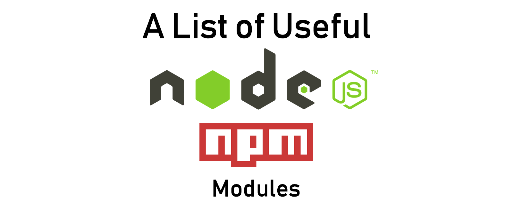

* Use <kbd>Ctrl</kbd> + <kbd>F</kbd> or <kbd>command</kbd> + <kbd>F</kbd> to search for a module.
* Contributions are welcome.

Other awesome lists,
* [`Useful jQuery Plugins`](https://github.com/aravindnc/A-to-Z-List-of-Useful-jQuery-Plugins)
* [`Useful Wordpress Plugins`](https://github.com/aravindnc/A-to-Z-List-of-Useful-Wordpress-Plugins)

## Packages for development
List of packages needed for development.

### Frameworks
#### API Framework
* [`Actionhero`](http://www.actionherojs.com/) - Multi-transport Node.js API server with integrated cluster capabilities and delayed tasks.
* [`Restify`](http://restify.com/) - A Node.js web service framework optimized for building semantically correct RESTful web services ready for production use at scale.
* [`FeathersJS`](http://feathersjs.com/) - An open source REST and realtime API layer for modern applications.
* [`Loopback`](http://loopback.io/) - Node.js framework for creating APIs and easily connecting to backend data sources.

#### Web Framework
* [`Express`](http://expressjs.com/) - Fast, unopinionated, minimalist web framework for Node.js
* [`Sails.js`](https://sailsjs.com/) - Sails is the most popular MVC framework for Node.js.
* [`Hapi`](http://hapijs.com/) - A rich framework for building applications and services.
* [`Koa`](http://koajs.com/) - Next generation web framework for Node.js
* [`NestJS`](https://github.com/nestjs/nest) - A progressive Node.js framework for building efficient and scalable server-side applications, heavily inspired by Angular.
- [`tinyhttp`](https://github.com/talentlessguy/tinyhttp) - 0-legacy, tiny & fast web framework as a replacement of Express 

#### Microservice Framework
* [`Micro`](http://github.com/zeithq/micro) - Asynchronous HTTP microservices.
* [`Micro Panda`](https://github.com/zhaoyao91/micro-panda) - Node.js toolkit to help build microservices.
* [`Micro-Whalla`](https://github.com/czerwonkabartosz/Micro-Whalla) - A simple, fast framework for writing microservices in Node.js communicate using RPC / IPC.
* [`Moleculer`](http://moleculer.services/) - Fast & powerful microservices framework for NodeJS.
* [`Seneca`](http://senecajs.org/) - A microservices toolkit for Node.js
* [`Serverless`](https://github.com/serverless/serverless) - Build and maintain web, mobile and IoT applications running on AWS Lambda and API Gateway (formerly known as JAWS).
* [`StdLib`](https://stdlib.com/) - Standard library for microservices.
* [`zeronode`](https://www.npmjs.com/package/zeronode) - A minimal building block for NodeJS microservices.

#### Machine Learning Framework
* [`TensorFlow JS`](https://www.tensorflow.org/js) - a JavaScript library for training and deploying models in the browser and on Node.js.

### Database
#### MongoDB & Helpers
* [`Mongoose`](http://mongoosejs.com) - Mongoose is a MongoDB object modeling tool designed to work in an asynchronous environment.
* [`Mongoose Paginate v2`](https://www.npmjs.com/package/mongoose-paginate-v2) - A customizable cursor based pagination plugin for Mongoose.

#### MySQL & Helpers
* [`MySQL`](https://www.npmjs.com/package/mysql) - A node.js driver for mysql. It is written in JavaScript, does not require compiling.
* [`Sequelize`](https://www.npmjs.com/package/sequelize) - Sequelize is a promise-based Node.js ORM for Postgres, MySQL, SQLite and Microsoft SQL Server.
* [`Knex.js`](https://knexjs.org/) Knex.js is a "batteries included" SQL query builder for Postgres, MSSQL, MySQL, MariaDB, SQLite3, Oracle, and Amazon Redshift designed to be flexible, portable, and fun to use.

### Development
* [`Async`](https://caolan.github.io/async/) - Async is a utility module which provides straight-forward, powerful functions for working with asynchronous JavaScript.
* [`Cheerio`](https://cheerio.js.org/) - jQuery for Server side. Fast, flexible, and lean implementation of core jQuery designed specifically for the server.
* [`PDFKit`](https://github.com/foliojs/pdfkit) - A JavaScript PDF generation library for Node and the browser.
* [`Faker`](https://github.com/Marak/Faker.js) - Generate massive amounts of fake data in the browser and node.js
* [`Through`](https://github.com/dominictarr/through) - simple way to create a ReadableWritable stream that works
* [`browserify`](https://github.com/browserify/browserify) - browser-side require() the node.js way

#### File System
* [`fs-extra`](https://github.com/jprichardson/node-fs-extra) - Node.js: extra methods for the fs object like copy(), remove(), mkdirs()

#### Command Line
* [`Inquirer.js`](https://github.com/SBoudrias/Inquirer.js#readme) - A collection of common interactive command line user interfaces.
* [`Commander.js`](https://github.com/tj/commander.js/) - The complete solution for node.js command-line interfaces, inspired by Ruby's commander.

#### Parser
* [`NodeCSV`](https://github.com/adaltas/node-csv) - Full featured CSV parser with simple api and tested against large datasets. 
* [`ShowdownJS`](https://www.npmjs.com/package/showdown) - Markdown to HTML converter JS library

#### Image Processing
* [`GM`](https://github.com/aheckmann/gm) - GraphicsMagick and ImageMagick for node
* [`Sharp`](https://github.com/lovell/sharp) - High performance Node.js image processing, the fastest module to resize JPEG, PNG, WebP and TIFF images. Uses the libvips library.

#### Utility Library
* [`Lodash`](https://lodash.com/) - a JavaScript library which provides utility functions for common programming tasks using the functional programming paradigm.
* [`Underscore.js`](https://underscorejs.org/) - A JavaScript library that provides a whole mess of useful functional programming helpers without extending any built-in objects.  

#### Validation and Formatting
* [`Validator.js`](https://github.com/validatorjs/validator.js) - A library of string validators and sanitizers.
* [`MomentJs`](https://www.npmjs.com/package/moment) - A lightweight JavaScript date library for parsing, validating, manipulating, and formatting dates.
* [`express-validator`](https://www.npmjs.com/package/express-validator) - An express.js middleware for validator.js.

#### Minifiers
* [`HTML Minifier`](https://github.com/kangax/html-minifier) - Javascript-based HTML compressor/minifier (with Node.js support) 
* [`CleanCSS`](https://github.com/jakubpawlowicz/clean-css) - Fast and efficient CSS optimizer for node.js and the Web
* [`UglifyJS2`](https://github.com/mishoo/UglifyJS2) - UglifyJS is a JavaScript parser, minifier, compressor and beautifier toolkit.
* [`SVGO`](https://github.com/svg/svgo) - SVG Optimizer is a Nodejs-based tool for optimizing SVG vector graphics files. 

#### Templates 
* [`EJS`](https://github.com/mde/ejs) - Embedded JavaScript templates
* [`hbs`](https://github.com/pillarjs/hbs) - Express.js template engine plugin for Handlebars

#### Authentication 
* [`PassportJS`](http://www.passportjs.org/) - Passport is authentication middleware for Node.js and Express . A 
comprehensive set of strategies support authentication using a username and password, Facebook, Twitter, and more.
* [`JSON Web Token`](https://www.npmjs.com/package/jsonwebtoken) - Implementation of JSON Web Tokens

#### Upload Files
* [`express-fileupload`](https://github.com/richardgirges/express-fileupload) - Simple express middleware for uploading files.
* [`Multer-JS`](https://github.com/expressjs/multer) - Multer is a node.js middleware for handling multipart/form-data, which is primarily used for uploading files. It is written on top of busboy for maximum efficiency.

#### Form Information
* [`Body-parser`](https://github.com/expressjs/body-parser) - Node.js body parsing middleware - Parse incoming request bodies in a middleware before your handlers, available under the req.body property.

#### Flash Messages
* [`connect-flash`](https://github.com/jaredhanson/connect-flash) - The flash is a special area of the session used for storing messages. Messages are written to the flash and cleared after being displayed to the user. The flash is typically used in combination with redirects, ensuring that the message is available to the next page that is to be rendered.

#### EMail
* [`Nodemailer`](http://nodemailer.com/) - Send e-mails with Node.JS – easy as cake!
* [`Express-Mailer`](https://github.com/RGBboy/express-mailer) - Send Emails from your application and response object.

#### HTTP REST Client
* [`Axios`](https://www.npmjs.com/package/axios) - Promise based HTTP client for the browser and node.js
* [`Request`](https://www.npmjs.com/package/request) - Request is designed to be the simplest way possible to make http calls. It supports HTTPS and follows redirects by default.
* [`method-override`](https://github.com/expressjs/method-override) - Lets you use HTTP verbs such as PUT or DELETE in places where the client doesn't support it.

#### Realtime Tasks
* [`Socket.IO`](https://www.npmjs.com/package/socket.io) - Socket.IO enables real-time bidirectional event-based communication.

#### Job Scheduler & Queueing
* [`CRON`](https://www.npmjs.com/package/cron) - Cron is a tool that allows you to execute something on a schedule.
* [`Agenda`](https://www.npmjs.com/package/agenda) - A light-weight job scheduling library for Node.js.
* [`Node Schedule`](https://www.npmjs.com/package/node-schedule) - A flexible job scheduler for Node.js that can perform different types of scheduling: Cron-style, Data-based and Recurrence Rule. 

#### Robotic Process Automation & Desktop Automation
* [`ROBOTJS`](https://www.npmjs.com/package/robotjs)Node.js Desktop Automation. Control the mouse, keyboard, and read the screen.
* [`Puppeteer`](https://www.npmjs.com/package/puppeteer)Puppeteer is a Node library which provides a high-level API to control Chrome or Chromium over the DevTools Protocol.

#### Automation
* [`Grunt`](https://www.npmjs.com/package/grunt) - Grunt is a JavaScript task runner, a tool used to automatically perform frequent tasks such as minification, compilation, unit testing, and linting.
* [`Gulp`](https://www.npmjs.com/package/gulp) - Gulp is a task runner used for automation of time-consuming and repetitive tasks involved in web development like minification, concatenation, cache busting, unit testing, linting, optimization, etc.

#### Terminal / Command Line
* [`Commander`](https://www.npmjs.com/package/commander) - The complete solution for node.js command-line interfaces, inspired by Ruby's commander.
* [`Colors`](https://www.npmjs.com/package/colors) - Easily add ANSI colors to your text and symbols in the terminal.
* [`Chalk`](https://github.com/chalk/chalk-cli) - Terminal string styling done right.

#### Game
* [`ox`](https://github.com/OttoRobba/ox) - tiny 2D game framework for the web
* [`Selfish`](https://github.com/Gozala/selfish) - class-free, pure prototypal inheritance
* [`Mibbu`](https://github.com/michalbe/mibbu) - Javascript game microframework
* [`jAllegro`](http://jallegro.sos.gd/) - JavaScript port of a game programming library
* [`Ocelot`](https://github.com/geoffb/ocelot) - minimalist HTML5 2D game engine, Ocelot aims for simplicity and small filesize
* [`js13k-boilerplate`](https://github.com/ooflorent/js13k-boilerplate) - js13kGames boilerplate
* [`js13k-toolkit`](https://github.com/lucaspenney/js13k-toolkit) - starter repository for js13kGames, a set of tools for developing a JS game and keeping it under 13kb
* [`js13k-requirejs`](https://github.com/spmurrayzzz/js13k-requirejs) - require.js-powered application template with build tools
* [`js13k-rollup`](https://github.com/spmurrayzzz/js13k-rollup) - gulp/rollup.js powered template with support for ES2015 modules and build tools
* [`js13k-starter`](https://github.com/aymanfarhat/js13k-starter) - sample js13k project structure, example and Gulp build process
* [`Tiny-Canvas`](https://github.com/bitnenfer/tiny-canvas) - lightweight minimal implementation of a batched and stack matrix based Canvas with WebGL backend
* [`Ga`](https://github.com/kittykatattack/ga) - tiny, cute and friendly system for making HTML5 games
* [`platform-engine`](https://github.com/xem/platform-engine) - 2D platform engine that handles collisions, slopes, rotations, etc.
* [`js13kGames-boilerplate`](https://github.com/voronianski-on-games/js13kGames-boilerplate) - includes game loop, utility functions and webpack config to package game with just one command
* [`js13k-webpack-starter`](https://github.com/sz-piotr/js13k-webpack-starter) - build with a single command, dev server, es2015 support
* [`js13k-base`](https://github.com/aerze/js13k-base) - simple commands, a server, and a sample game + framework
* [`js13kgames-parcel-starter`](https://github.com/mtmckenna/js13kgames-parcel-starter) - starter repo to build, zip, and check the file size of your game with a single command
* [`responsiveTouchGameFramework`](https://github.com/xem/responsiveTouchGameFramework) - responsive canvas game framework with unified mouse / tactile inputs
* [`Tweetwork`](https://twitter.com/MaximeEuziere/status/883044404453294080) - a 140b canvas game framework
* [`Kontra`](https://straker.github.io/kontra/) - a lightweight JavaScript gaming micro-library, optimized for js13kGames
* [`JS13K 2017 Kit`](https://github.com/Rybar/js13k2017kit) - a pico-8 like graphics engine and game boilerplate

#### Testing
* [`Mocha`](https://www.npmjs.com/package/mocha) - Simple, flexible, fun JavaScript test framework for Node.js & The Browser
* [`Chai`](https://www.chaijs.com/) - Chai is a BDD / TDD assertion library for node and the browser that can be delightfully paired with any javascript testing framework.
* [`Jest`](https://jestjs.io/) - Jest is a delightful JavaScript Testing Framework with a focus on simplicity..
* [`Enzyme`](https://airbnb.io/enzyme/) - Enzyme is a JavaScript Testing utility for React that makes it easier to test your React Components' output. You can also manipulate, traverse, and in some ways simulate runtime given the output
* [`cucumber Gherkin`](https://cucumber.io/docs/gherkin/) - JCucumber is a tool that supports Behaviour-Driven Development(BDD).
* [`React Testing Library`](https://testing-library.com/docs/react-testing-library/intro) - The React Testing Library is a very light-weight solution for testing React components. The more your tests resemble the way your software is used, the more confidence they can give you.

### Code Quality
#### Linting
* [`ESLint`](https://eslint.org/) - The pluggable linting utility for JavaScript and JSX
* [`JSHint`](https://www.npmjs.com/package/jshint) - A Static Code Analysis Tool for Javascript.

## Packages for Management & Operations
List of packages needed for management and operations.

#### Loggers/Logging
* [`Winston`](https://www.npmjs.com/package/winston) - A logger for just about everything.
* [`Morgan`](https://www.npmjs.com/package/morgan) - HTTP request logger middleware for node.js

#### Monitoring
* [`PM2`](https://www.npmjs.com/package/pm2) - It allows you to keep applications alive forever, to reload them without downtime and facilitate common Devops tasks.
* [`Forever`](https://www.npmjs.com/package/forever) - A simple CLI tool for ensuring that a given script runs continuously (i.e. forever).
* [`nodemon`](https://github.com/remy/nodemon) - Monitor for any changes in your node.js application and automatically restart the server - perfect for development
* [`Trace`](https://github.com/RisingStack/trace-nodejs) - A visualised stack trace platform designed for microservices.

#### Code Quality Analysis
* [`Plato`](https://github.com/es-analysis/plato) - JavaScript source code visualization, static analysis, and complexity tool.

#### Boost Productivity
* [`ProjectMan`](https://github.com/saurabhdaware/projectman) - A Project Manager to add projects to favorites and open them from your command-line.
